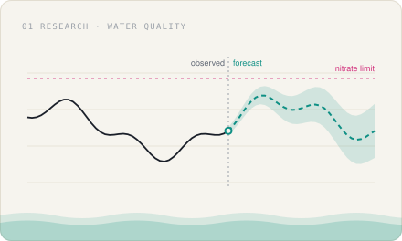
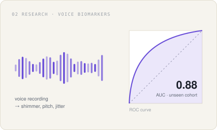
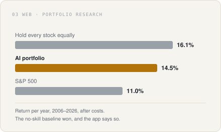
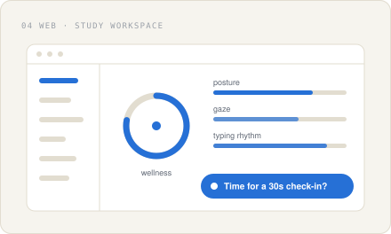
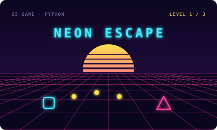

<picture>
  <source media="(prefers-color-scheme: dark)" srcset="assets/hero-dark.svg">
  
</picture>

<table>
  <tr>
    <td width="50%">
      <a href="https://github.com/a6nkay-source/Hydrosense">
        <picture>
          <source media="(prefers-color-scheme: dark)" srcset="assets/hydrosense-dark.svg">
          
        </picture>
      </a>
    </td>
    <td width="50%">
      <h3><a href="https://github.com/a6nkay-source/Hydrosense">Hydrosense</a></h3>
      
<b>Water-quality forecasts for US rivers.</b> Started as a physics-informed neural network predicting nitrate risk in Alameda Creek, California, from live stream gauges, weather and satellite imagery. It now forecasts across USGS stations in any state, is validated on stations and states it never trained on, and tracks its own accuracy in a public dashboard.

      
<code>Python</code> · <code>PyTorch</code> · <code>PINN</code> · <code>USGS data</code> · <a href="https://github.com/a6nkay-source/Hydrosense">source</a>

    </td>
  </tr>
  <tr>
    <td width="50%">
      <h3><a href="https://github.com/a6nkay-source/Parkinson-Model-Detection">Parkinson's Voice Model</a></h3>
      
<b>Does a voice-based Parkinson's classifier survive new patients?</b> Trained on one public cohort, then tested on completely independent ones: 0.88 AUC on one, 0.67 on another, lifted to 0.75 with label-free adaptation. It also reproduces two popular repos and shows where their accuracy comes from data leakage.

      
<code>Python</code> · <code>LightGBM</code> · <code>SHAP</code> · <code>UCI cohorts</code> · <a href="https://github.com/a6nkay-source/Parkinson-Model-Detection">source</a>

    </td>
    <td width="50%">
      <a href="https://github.com/a6nkay-source/Parkinson-Model-Detection">
        <picture>
          <source media="(prefers-color-scheme: dark)" srcset="assets/parkinson-dark.svg">
          
        </picture>
      </a>
    </td>
  </tr>
  <tr>
    <td width="50%">
      <a href="https://github.com/a6nkay-source/Stock-Prediction-Model">
        <picture>
          <source media="(prefers-color-scheme: dark)" srcset="assets/stocks-dark.svg">
          
        </picture>
      </a>
    </td>
    <td width="50%">
      <h3><a href="https://github.com/a6nkay-source/Stock-Prediction-Model">AI Stock Research Lab</a></h3>
      
<b>A stock predictor that reports what the models actually did.</b> Built for the Wharton Global Youth investment competition. It scores 74 large-cap US stocks over 1 to 12 months, builds a portfolio for an investor profile, and backtests it over 20 years. The portfolio beat the S&amp;P 500 but lost to simply holding everything equally, and the app says so on the page.

      
<code>TypeScript</code> · <code>Python</code> · <code>walk-forward backtests</code> · <a href="https://github.com/a6nkay-source/Stock-Prediction-Model">source</a>

    </td>
  </tr>
  <tr>
    <td width="50%">
      <h3><a href="https://github.com/a6nkay-source/Anchor">Anchor</a></h3>
      
<b>A study workspace that checks in on you.</b> Courses, assignments, notes, flashcards and a Socratic AI tutor in one place. While you work it reads posture and gaze from the webcam and rhythm from your typing, then nudges you to take a break. Camera frames never leave the browser.

      
<code>Next.js</code> · <code>TypeScript</code> · <code>MediaPipe</code> · <code>Tailwind</code> · <a href="https://github.com/a6nkay-source/Anchor">source</a>

    </td>
    <td width="50%">
      <a href="https://github.com/a6nkay-source/Anchor">
        <picture>
          <source media="(prefers-color-scheme: dark)" srcset="assets/anchor-dark.svg">
          
        </picture>
      </a>
    </td>
  </tr>
  <tr>
    <td width="50%">
      <a href="https://github.com/a6nkay-source/Neon-Escape">
        <picture>
          <source media="(prefers-color-scheme: dark)" srcset="assets/neon-dark.svg">
          
        </picture>
      </a>
    </td>
    <td width="50%">
      <h3><a href="https://github.com/a6nkay-source/Neon-Escape">Neon Escape</a></h3>
      
<b>Grab the coins, dodge the enemy, get out.</b> A neon escape-room arcade game written in Python. Collect enough coins to unlock the next level while something chases you through the map.

      
<code>Python</code> · <code>3 levels</code> · <a href="https://github.com/a6nkay-source/Neon-Escape">source</a>

    </td>
  </tr>
</table>

  <picture>
    <source media="(prefers-color-scheme: dark)" srcset="https://streak-stats.demolab.com?user=a6nkay-source&hide_border=true&background=00000000&ring=3fd0c0&fire=f2b248&currStreakNum=e8edf4&sideNums=e8edf4&currStreakLabel=3fd0c0&sideLabels=8b98a9&dates=556275&stroke=243042">
    
  </picture>

  Also: <a href="https://github.com/a6nkay-source/pixel_art">pixel art in Python</a> · <a href="https://github.com/a6nkay-source/stanghacks">StangHacks 2026</a> · <a href="https://github.com/a6nkay-source?tab=repositories">all repositories</a>

