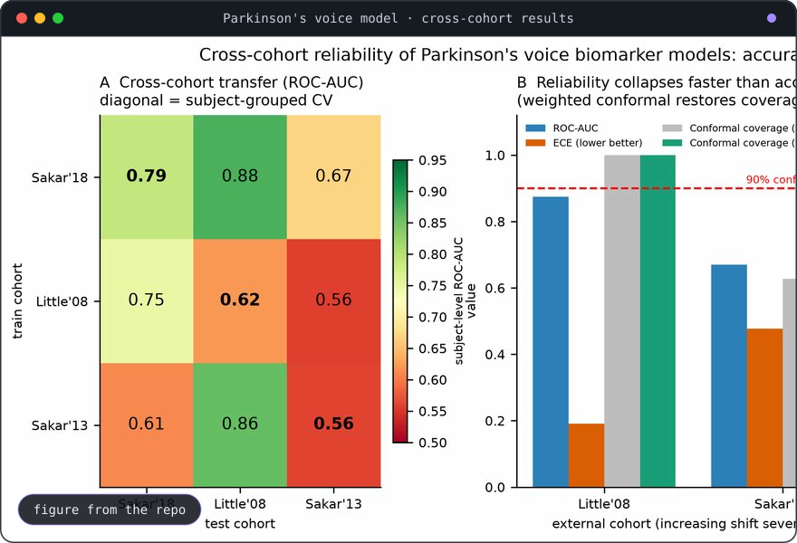
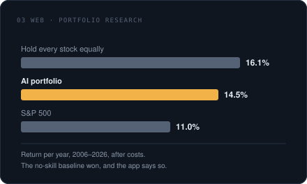
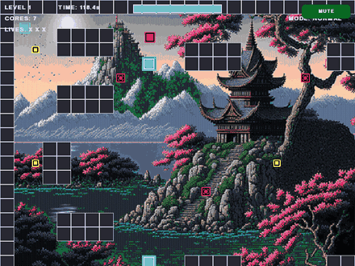

<picture>
  <source media="(prefers-color-scheme: dark)" srcset="assets/hero-dark.svg">
  
</picture>

<table>
  <tr>
    <td width="33%" valign="top">
      <h4>Med-tech research</h4>
      
Voice-biomarker models for Parkinson's disease, validated across independent patient cohorts with calibration, domain-shift and leakage analysis. On-device wellness and burnout signals in Anchor.

    </td>
    <td width="33%" valign="top">
      <h4>Business and finance</h4>
      
Portfolio research for the Wharton Global Youth investment competition: walk-forward models on 74 large-cap stocks, backtested from 2006 to 2026 after costs and measured against honest benchmarks.

    </td>
    <td width="33%" valign="top">
      <h4>Engineering</h4>
      
Python and TypeScript end to end: PyTorch, LightGBM, FastAPI, React and Next.js. Reproducible pipelines, offline test suites, Docker and one-command reruns.

    </td>
  </tr>
</table>

<table>
  <tr>
    <td width="50%">
      
    </td>
    <td width="50%">
      <h3><a href="https://github.com/a6nkay-source/Parkinson-Model-Detection">Parkinson's Voice AI</a></h3>
      
<b>Does a voice-based Parkinson's classifier survive new patients?</b> Trained on one public cohort, then tested on completely independent ones: 0.88 AUC on one, 0.67 on another, lifted to 0.75 with label-free adaptation. It measures calibration and domain shift, explains predictions with SHAP, and reproduces two popular repos to show where their accuracy comes from data leakage.

      
<code>Python</code> · <code>LightGBM</code> · <code>SHAP</code> · <code>conformal prediction</code> · <a href="https://github.com/a6nkay-source/Parkinson-Model-Detection">source</a>

    </td>
  </tr>
  <tr>
    <td width="50%">
      <h3><a href="https://github.com/a6nkay-source/Anchor">Anchor</a></h3>
      
<b>A study workspace that watches out for you.</b> Courses, assignments, notes, flashcards and a Socratic AI tutor in one place. While you work it reads posture, gaze and blink rate from the webcam and rhythm from your typing, turns them into a wellness score and a burnout forecast, and nudges you to take a break. Camera frames never leave the browser.

      
<code>Next.js</code> · <code>TypeScript</code> · <code>MediaPipe</code> · <code>Tailwind</code> · <a href="https://github.com/a6nkay-source/Anchor">source</a>

    </td>
    <td width="50%">
      
    </td>
  </tr>
  <tr>
    <td width="50%">
      
    </td>
    <td width="50%">
      <h3><a href="https://github.com/a6nkay-source/Stock-Prediction-Model">AI Stock Research Lab</a></h3>
      
<b>A stock predictor that reports what the models actually did.</b> Built for the Wharton Global Youth investment competition. It scores 74 large-cap US stocks over 1 to 12 months, builds a portfolio for an investor profile, and backtests it over 20 years after costs. The portfolio beat the S&amp;P 500 but lost to simply holding everything equally, and the app says so on the page.

      
<code>TypeScript</code> · <code>React</code> · <code>Python</code> · <code>FastAPI</code> · <a href="https://github.com/a6nkay-source/Stock-Prediction-Model">source</a>

    </td>
  </tr>
  <tr>
    <td width="50%">
      <h3><a href="https://github.com/a6nkay-source/Hydrosense">Hydrosense</a></h3>
      
<b>Water-quality forecasts for US rivers.</b> Started as a physics-informed neural network predicting nitrate risk in Alameda Creek, California, from live stream gauges, weather and satellite imagery. It now forecasts across 359 USGS stations, is validated on stations and states it never trained on, and tracks its own accuracy in a public dashboard.

      
<code>Python</code> · <code>PyTorch</code> · <code>PINN</code> · <code>USGS data</code> · <a href="https://github.com/a6nkay-source/Hydrosense">source</a>

    </td>
    <td width="50%">
      
    </td>
  </tr>
  <tr>
    <td width="50%">
      
    </td>
    <td width="50%">
      <h3><a href="https://github.com/a6nkay-source/Neon-Escape">Neon Escape</a></h3>
      
<b>Grab the cores, dodge the enemy, reach the portal.</b> A maze-escape arcade game written in Python with pygame. Three levels, bombs, teleporters, a dash ability, and enemies that hunt you with A* pathfinding. The clip is a recording of the real game.

      
<code>Python</code> · <code>pygame</code> · <code>A* pathfinding</code> · <a href="https://github.com/a6nkay-source/Neon-Escape">source</a>

    </td>
  </tr>
</table>

  <picture>
    <source media="(prefers-color-scheme: dark)" srcset="https://streak-stats.demolab.com?user=a6nkay-source&hide_border=true&background=00000000&ring=3fd0c0&fire=f2b248&currStreakNum=e8edf4&sideNums=e8edf4&currStreakLabel=3fd0c0&sideLabels=8b98a9&dates=556275&stroke=243042">
    
  </picture>

  Also: <a href="https://github.com/a6nkay-source/pixel_art">pixel art in Python</a> · <a href="https://github.com/a6nkay-source/stanghacks">StangHacks 2026</a> · <a href="https://github.com/a6nkay-source?tab=repositories">all repositories</a>

